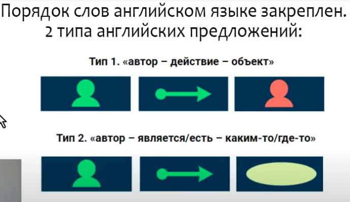

тип 1 - автор -> действие -> объект
I like you
You study english
He drives a car

тип 2 - автор -> является/есть -> каким-то/где-то (описание?)
                    /|\
                     |
            особая группа глаголов 
     linkin verbs (самый известный -be)
I am a teacher
You are nice
He is happy
